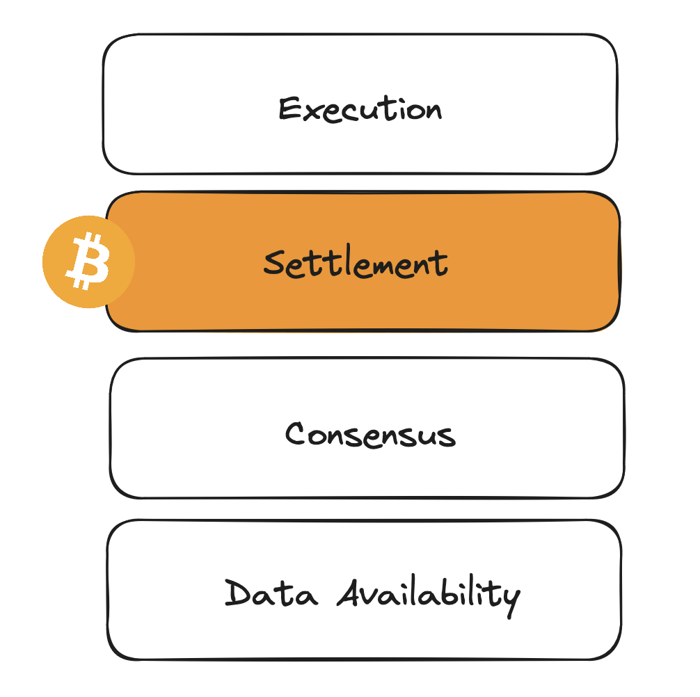

# Towards a Modular Ecosystem

A blockchain can be comprised of four core functions:

* **Execution**: Transactions or state transitions must be correctly applied onto the existing state machine.
* **Settlement (optional):** The blockchain can verify proofs and bridge between one or more execution layers (also known as rollups).
* **Consensus**: Nodes can agree on the ordering of transactions.
* **Data** **Availability**: The transaction data is freely available to nodes to verify the legitimacy of state transitions.

As blockchains rapidly move towards more modular architectures, we have witnessed the different responsibilities of a blockchain being taken on by more specialized modules or layers, each focusing on one of the above functions. Data Availability Layers like Celestia focus on optimizing data throughput so that many rollups can post data to them. Execution Layers focus on providing low-latency transactions to users for improved UX. In a modular future, another aspect that becomes extremely important is settlement. As execution disperses across chains, settlement is a critical requirement to allow for interoperability and value transfer between these chains.

As Bitcoin does not have a Turing-complete execution environment, the notion of settlement on Bitcoin does not exist. That is to say that there is no consistent or general way to build for interoperable and expressive applications on top of Bitcoin. We provide Asula as this settlement layer, cementing the foundations for a Bitcoin-aligned modular ecosystem.

<figure><figcaption>
The core responsibilities of a blockchain
</figcaption></figure>

